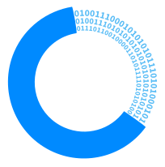

# Introduction

*Akvorado*[^name] is a flow collector, hydrater and exporter. It
receives flows, adds some data like interface names and countries, and
exports them to Kafka.

[^name]: [Akvorado][] means "water wheel" in Esperanto.

[Akvorado]: https://eo.wikipedia.org/wiki/Akvorado

## Big picture

The general design of *Akvorado* is the following:

- The exporters send Netflow and IPFIX flows to Akvorado. They don't
  need to be declared as Akvorado accepts flows from anyone.
- The received flows are decoded and hydrated with additional
  information:
   - source and destination countries (GeoIP database)
   - source and destination AS numbers (GeoIP database)
   - source and destination interface names, descriptions and speeds (SNMP)
- The SNMP poller queries the exporters for host names, interface
  names, interface descriptions and interface speeds. This information
  is cached and updated from time to time.
- Once a flow is hydrated, it is transformed into a binary
  representation using *protocol buffers* and sent to Kafka.

The remaining steps are outside of *Akvorado* control:

- ClickHouse subscribes to the Kafka topic to receive and store the
  flows.
- Grafana queries ClickHouse to build various dashboards.

## Flow schema

Flows sent to Kafka are encoded with a versioned schema, described in
the `flow-*.proto` files. Any information that could change with time
is embedded in the flow. This includes for example interface names and
speeds, as well. This ensures that older data are not processed using
incorrect mappings.

Each time the schema changes, we issue a new `flow-*.proto` file,
update the schema version and a new Kafka topic will be used. This
ensures we do not mix different schemas in a single topic.
